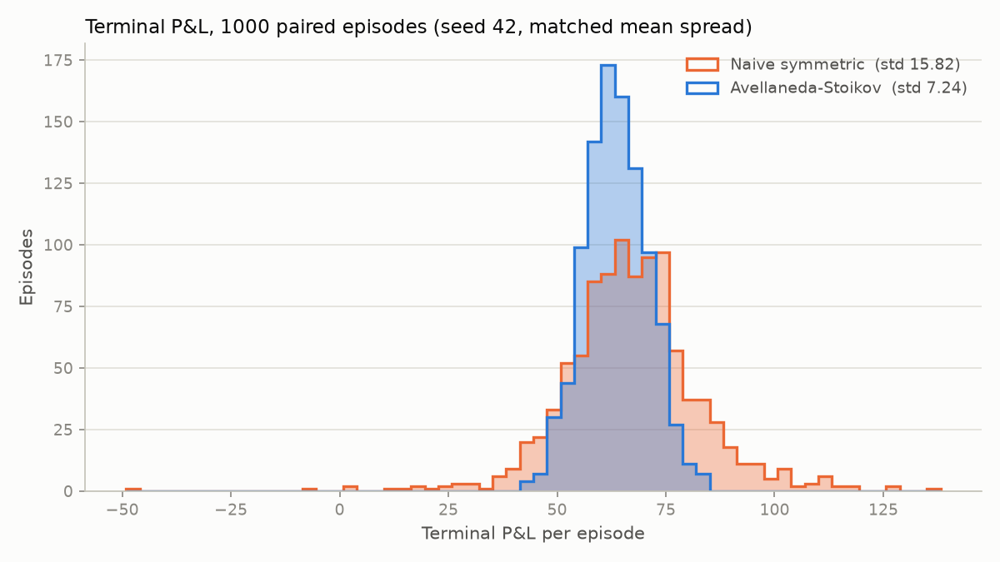
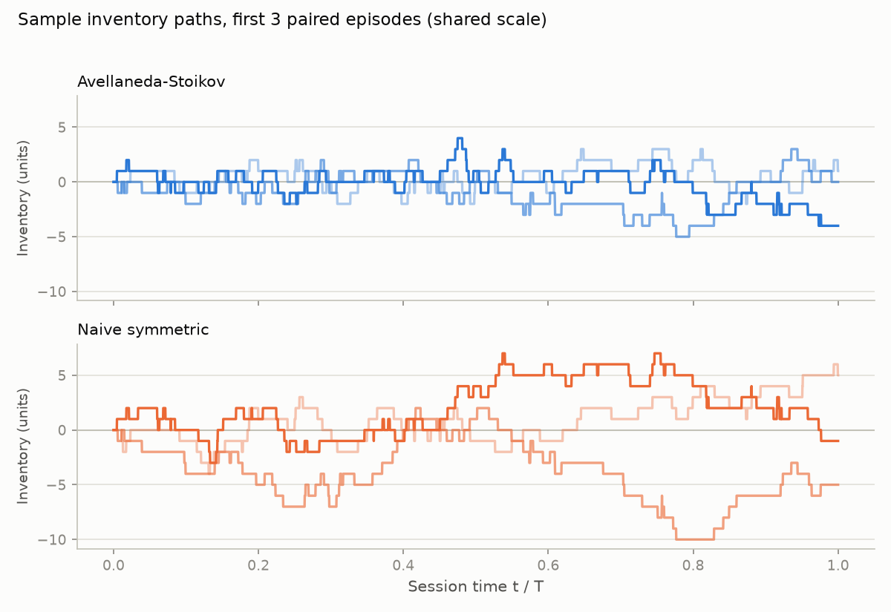

# mmsim — Avellaneda–Stoikov market-making simulator

[](https://github.com/harvey-a11y/market-making-sim/actions/workflows/ci.yml)

A discrete-time simulator of a single-asset market maker over one trading
session, comparing the Avellaneda–Stoikov (2008) inventory strategy against a
naive symmetric quoter **at matched average spread**, under paired random
seeds. The point of the comparison: with the same average quoted spread, does
inventory-aware quote skewing actually reduce risk? (Answer below: yes,
materially.)

Built after attending the AmplifyMe × Goldman Sachs market-making simulation,
where the core lesson was that quoting width is easy and inventory management
is the hard part. This project makes that lesson quantitative.

## Model

**Midprice.** Arithmetic Brownian motion, `dS = σ dW`, simulated on a grid of
`T_steps = 3600` steps with the session horizon normalised to `T = 1`
(`dt = 1/T_steps`). σ is expressed per session.

**Order flow.** Market orders arrive on each side as a Poisson process. Against
our quote at distance δ from the mid, the fill intensity is

```
λ(δ) = A · exp(−k · δ)
```

Per step, the fill probability is `1 − exp(−λ(δ)·dt)`. One unit per fill,
quotes refreshed every step. A fill at our bid: `q += 1`, `cash −= (S − δ_b)`;
at our ask: `q −= 1`, `cash += (S + δ_a)`.

**Avellaneda–Stoikov strategy.** Closed-form reservation price and half-spread:

```
r(S, q, t) = S − q · γ · σ² · (T − t)
δ(t)       = γ · σ² · (T − t) / 2 + (1/γ) · ln(1 + γ/k)
```

Bid quoted at `r − δ`, ask at `r + δ`. Long inventory pushes both quotes down
(making a sell more likely); the half-spread decays linearly to its terminal
value as `t → T`.

**Naive baseline.** Fixed symmetric half-spread around the mid, set equal to
the time-average of the A–S half-spread over the same quote grid, so both
strategies quote the same mean spread and differ only in where it is centred.

**Terminal condition.** Both strategies liquidate terminal inventory at the
final mid (mark-to-market, no additional penalty).

**Pairing.** Each episode's price path and per-step arrival uniforms are drawn
once and replayed against both strategies (common random numbers), so
cross-strategy differences are attributable to the quoting rule, not sampling
noise.

## Parameters

| Parameter | Symbol | Default | Meaning |
|---|---|---:|---|
| Volatility | σ | 2.0 | midprice vol per session (T = 1) |
| Arrival scale | A | 140.0 | baseline fill intensity, per unit time |
| Arrival decay | k | 1.5 | intensity decay per unit quote distance |
| Risk aversion | γ | 0.1 | A–S inventory-risk parameter |
| Steps per episode | T_steps | 3600 | quote-refresh grid over the session |
| Episodes | N | 1000 | Monte Carlo paired episodes |
| Initial mid | S₀ | 100.0 | arbitrary level (ABM, so it only sets scale of prices, not P&L) |
| Adverse-selection horizon | h | 60 | steps ahead for the post-fill drift proxy (fills without a complete window are excluded) |

With the defaults the matched naive half-spread is 0.7454.

## Install and run

Python ≥ 3.11.

```
python -m venv .venv
.venv\Scripts\python.exe -m pip install -e .[test]
.venv\Scripts\python.exe -m mmsim run --episodes 1000 --gamma 0.1 --seed 42 --plot examples/comparison.png
```

`python -m mmsim run --help` lists all flags (σ, A, k, steps, and a second
`--plot-inventory` output).

## Results (1000 episodes, seed 42, defaults)

```
Metric                             Avellaneda-Stoikov      Naive symmetric
--------------------------------------------------------------------------
Mean terminal P&L                             +63.559              +67.123
Std terminal P&L                                7.238               15.825
Mean/std of terminal P&L                         8.78                 4.24
Mean |terminal inventory|                        2.65                 7.92
Inventory variance (path mean)                   2.19                15.68
Mean max |inventory|                             4.62                11.62
Fills per episode                                97.5                 90.7
Adverse-selection proxy                       +0.0008              +0.0009

Paired inference (Avellaneda-Stoikov minus Naive symmetric, 1000 paired episodes):
Mean terminal P&L difference        -3.564  (SE 0.428)
95% CI, t-based (df=999)            [-4.403, -2.725]
Std reduction (1 - std_AS/std_nv)   54.3%
Bootstrap 95% CI (10000 resamples)  [50.1%, 58.1%]
```

At the same average quoted spread, Avellaneda–Stoikov cuts terminal P&L
standard deviation by 54.3% (paired-bootstrap 95% CI [50.1%, 58.1%], 10,000
resamples) and path inventory variance by 86%, at the cost of about 5% of
mean P&L: the per-episode paired difference is −3.564 (SE 0.428, t-based 95%
CI [−4.403, −2.725]), so the give-up is small but statistically resolved (the
skewed side quotes inside the naive quote, giving up a little edge per round
trip to shed inventory). "Mean/std of terminal P&L" is exactly that ratio
over episode P&Ls — it is not a Sharpe ratio, since these are not returns on
a time series. The adverse-selection proxy — the mean signed 60-step midprice
move after each fill, from the position's perspective, with fills in the last
60 steps excluded because their lookahead window is incomplete — is
indistinguishable from zero for both strategies, which is expected: arrivals
here are uninformed by construction, so this model contains no adverse
selection to defend against (see limitations).





## Tests

```
.venv\Scripts\python.exe -m pytest
```

Covers: λ(δ) strictly decreasing; reservation price below the mid when long
(and symmetric when short, equal when flat); half-spread shrinking as `t → T`;
a paired-seed 200-episode run asserting A–S inventory variance and P&L std
are both below the naive quoter's; bit-for-bit reproducibility of a
same-seed rerun; the Student-t quantile against standard critical values; a
synthetic-data check that the paired CI recovers a known effect; bootstrap-CI
determinism under a fixed seed; exclusion of incomplete-horizon fills from
the adverse-selection proxy (pinned exactly on a linear path); and the
empirical fill rate against `A·exp(−k·δ)·dt` on fixed quotes.

## Limitations

- **Exponential fill model.** `λ(δ) = A·exp(−k·δ)` is the A–S modelling
  assumption, not an empirical fill curve; real fill probabilities depend on
  queue dynamics and order sizes.
- **Bernoulli fill approximation; crossing quotes fill at the quoted price.**
  Each step allows at most one fill per side: the Poisson arrival intensity
  is collapsed into a single Bernoulli draw with probability
  `1 − exp(−λ(δ)·dt)`, so multiple arrivals inside one step are undercounted
  (a small effect at `λ·dt ≪ 1`, but an approximation, not an exact Poisson
  scheme — a test validates the empirical fill rate against `A·exp(−k·δ)·dt`
  on fixed quotes). And when inventory skew pushes a quote through the mid,
  the order still executes at the quoted price via the same intensity
  function; a real venue would fill such a crossing order at the touch, so
  aggressive quotes are stylized here rather than realistic.
- **No informed flow.** Arrivals are independent of future price moves, so
  adverse selection — a first-order cost for real market makers — is absent
  (the proxy metric confirms this). The variance reduction shown is purely
  inventory-risk management.
- **Unit size.** One unit per fill, no order sizing decision.
- **No queue position or book depth.** We are always fillable at our quoted
  distance; there is no priority, no partial fills, no competing quotes.
- **No real LOB data.** Prices are simulated ABM; no microstructure noise,
  ticks, or sessions from data.
- **Terminal liquidation at mid.** Residual inventory exits at the final mid
  with no impact or penalty, which flatters both strategies equally but is
  generous.
- **No fees.** Maker/taker economics would shift the level of P&L for both
  strategies.

## Roadmap

- Replay against recorded L2 order-book data (fill simulation vs resting
  depth, queue position model).
- Maker/taker fee schedule and its effect on optimal γ.
- Order sizing beyond one unit; inventory caps.
- Calibration of A and k from trade/quote data.

## References

- M. Avellaneda and S. Stoikov, "High-frequency trading in a limit order
  book", *Quantitative Finance* 8(3), 2008.

## License

MIT — see [LICENSE](LICENSE). © 2026 Harvey Sohal.
